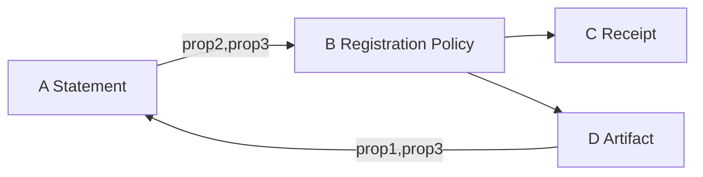
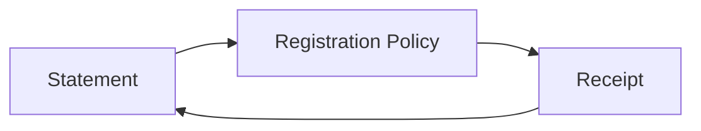

+++
date = 2023-11-13T05:00:00Z
lastmod = 2023-11-13T05:00:00Z
title = "IETF 118"
subtitle = "IETF 118 Notes"
+++

# 2023-11-03 Engineering Logs


- https://docs.rs/activitypub_federation/latest/activitypub_federation/
- https://github.com/LemmyNet/lemmy/tree/main/crates/apub


# 2023-11-04 Engineering Logs


## 2023-11-04 @pdxjohnny Engineering Logs

[](https://asciinema.org/a/619198)


## 2023-11-04 IETF 118 Hackathon Day 1

- https://datatracker.ietf.org/meeting/118/agenda
- SCITT table
  - Steve
  - Orie
  - Yogesh
  - Jon
  - Tristan
  - Cedrick
  - A.J. Stein
    - https://github.com/usnistgov/oscal-content
  - John
  - Henk Birkholz
  - Brent
  - Kaliya Young
- Snacks
- OIDC issuer as issuer of notary
- DID resolution discussion
  - `serviceAddress` WASM API floated
    - Prep for dataflow style
- Kick off
  - https://github.com/IETF-Hackathon/ietf118-project-presentations
    - https://github.com/IETF-Hackathon/ietf118-project-presentations/blob/main/.github/workflows/main.yml
  - Hackdemo Happy Hour on Monday 18:30 - 19:30 Registry by 13:00 Monday. Share hackathon projects
- Working on PR
  - https://github.com/scitt-community/scitt-api-emulator/pull/37
  - https://github.com/ietf-wg-scitt/draft-ietf-scitt-architecture/issues/79
- Discussion with Steve around OIDC issuer
  - https://github.com/ietf-wg-scitt/draft-ietf-scitt-architecture/issues/87#issuecomment-1716042275
  - Do we need more info than `did:web:token.....`
  - Moved arch to CWT, which makes it more obvious client side
    - Emulator needs to be updated
  - There's been discussion around re-writing the emulator in another language because the original Python maintainer left. However, no one has done it yet and both JA's like Python and have been contributing.
- https://datatracker.ietf.org/doc/draft-lemmons-composite-claims/
  - Pealing the layers of the onion of bearer token with policy, never comping back to transparency service
  - Exposes claim keys, know it contains subject
  - length analysis on enveloped?
    - Add padding?
    - Zero knowledge fixed length, selective disclosure BBS CNRG, proof of knowledge
  - https://datatracker.ietf.org/doc/bofreq-richer-wimse/
    - Workload Identity in Multi System Environments (WIMSE)
- No one respects DNS TTL at ISP level
- Entry ID within claim discussion
  - Options
    - Hash of A, order or A
      - Chair says says he will not implement
    - Unique ID such as UUID
  - One option was said to be adding the entry_id to the receipt
    - Orie advises a consensus call to resolve on what we should do here and put in the architecture
    - https://github.com/ietf-wg-scitt/draft-ietf-scitt-architecture/issues/79#issuecomment-1767445443
  - Process steps, write proposal, send to list, send PR, chair may be required to run consensus call if someone requests
  - One option would be to include in receipt the entry ID and if it's ordered or not
- Detached Payloads
  - From a logical sense, they are detached. From a COSE point of view everything is attached (the COSE header we use is attached), the attached payload contains the information to discover and verify (URI, hash)
- A.J. mentions backdooring compiled deps as nation state attacker path of choice
  - John mentioned SLSA L5 in progress with TEEs or L4 hermetic with federation would help detect backdoors
  - A.J. likes https://github.com/ietf-scitt/use-cases/pull/18
    - Trusted bot tells me how much I need to care, based on threat model
- Orie explains RDF
  - 
  - Expresses knowledge
  - Can use OWL for traversing first order logic, forward chaining
  - Prolog reasoning engine operates on information which is an expression of first order logic
  - RDF is an expression of first order logic that doesn't have one serialization
  - Triples is a concept which has many different ways of serialization which all have some disadvantage which results in us inventing new formats and replacing the old one
  - Turtle, NQuads, JSON-LD
  - Example
    - Subject, Predicate, Object
    - Brent, understands, CBOR (it may not be true but it's writable in RDF)
    - CBOR is-understood, by-cool-people
    - Brent, is-cool, true
  - The issue is, if you interpret the graph, you think that Brent
    - Your knowledge about the world expands about you add triples
    - You learn more every time you add a new triple, at the risk of inconsistency
  - Triples create a named graph (W3C name)
  - How do you ensure you know which Brent if there were multiple
    - Add scopes to get unique identifiers
      - http://website.example/Brent
        - With fragment or without fragment issue
  - What if we say definition of term under authority of URL?, use `url(...)`
    - url(Brent), url(understands), url(CBOR)
    - Now this issue is that you can resolve the url to a different thing every time, this is a bug says Orie, feature says rest of W3C WG, TODO find this at context issue/pr thread from a while back
  - John: What if we combined with receipts?
    - [2023-04-19 @pdxjohnny Engineering Logs](https://github.com/intel/dffml/blob/alice/docs/discussions/alice_engineering_comms/0243/reply_0000.md)
  - Henk Birkholz gives example of VEX and different parties saying something is a vuln or not within different contexts, USGov says no, GreenPeace says yes.
    - RDFStart is equivilant to labeled property graph, let's you put nodes on the edges
  - RATs versifiers use this.
  - Imagine we have an OSCAL component displayed by the React class, they both have the concept of a component
    - `https://oscal.org/Component(Component)`
    - `https://react.org/Component(Component)`
  - We could describe registration policies using labeled property graphs (Henk Birkholz says this is v2)
    - We want to find the intersections of what we agree
    - Machine can find that when we put it in URI/URL format
  - We can express any information in this format
    - Our question is, it it valuable to express it this way and share it
  - Are our policy graphs equivalent?
    - Isomorphic
    - You you build aggregates and do graph computations on aggregates







- What registration policy was evaluated when the claim became a receipt
  - We agree this is a requirement
  - Jon and John agree we should put this an ID of the relevant policy in the receipt
  - In v1 we don't have to agree what the policy ID points to
  - In v2 we might want to agree on a recommended format for the policy pointed to
- https://internetidentityworkshop.com/past-workshops/
  - Kaliya started IIW
  - Topics include Supply Chain Security!
  - https://github.com/trustoverip/tswg-trust-registry-tf/tree/main/v2#high-level
    - > 
- https://github.com/usnistgov/vulntology
  - Talked to Dave who works on this with A.J. at NIST about how this would be good for ad-hoc CVE creation, Dave said this was the original idea
    - https://github.com/ossf/wg-vulnerability-disclosures/issues/94#issuecomment-1483184591
  - https://bit.ly/aliceoa
    - Talked about Alice, threat modeling, iteration (Entity Analysis Trinity)
- TODO
  - [ ] Update emulator to CWT (CBOR Web Token)
    - https://www.iana.org/assignments/cwt/cwt.xhtml
    - https://datatracker.ietf.org/doc/draft-ietf-cose-cwt-claims-in-headers/
    - > CWT_Claims (label: 13 pending [CWT_CLAIM_COSE]): A CWT representing the Issuer (iss) making the statement, and the Subject (sub) to correlate a collection of statements about an Artifact. Additional [CWT_CLAIMS] MAY be used, while iss and sub MUST be provided
      > - iss (CWT_Claim Key 1): The Identifier of the signer, as a string
      >   - Example: did:web:example.com
      > - sub (CWT_Claim Key 2): The Subject to which the Statement refers, chosen by the Issuer
      >   - Example: github.com/opensbom-generator/spdx-sbom-generator/releases/tag/v0.0.13
    - Could you implement this off of GitHub Pages?
      - Potentially rotate jwks / cwks or store in secrets
  - [ ] Bring A.J. and Dave some Alice cards
  - [x] Post notes to IETF channel
    - https://zulip.ietf.org/#narrow/stream/300-scitt/topic/ietf-interim/near/93128


# 2023-11-05 Engineering Logs


## 2023-11-05 IETF 118 Hackathon Day 2

- A.J. is having issues with OpenAPI spec
  - [2023-03-23 @pdxjohnny Engineering Logs](https://github.com/intel/dffml/blob/alice/docs/discussions/alice_engineering_comms/0217/reply_0000.md)

```console
$ npx swagger-cli bundle docs/openapi/openapi.yml -o docs/openapi/openapi.json --dereference
```

- A.J. was wondering about the NVD v2 API code
  - https://github.com/intel/cve-bin-tool/blob/44b5e990657a43535365585e7a392921107a2fad/cve_bin_tool/data_sources/nvd_source.py#L356-L394
- Harold was doing SBOM for ML models in SCITT
  - Talk of the CycloneDX PRs
- A.J. says there is a NIST AI working group
  - Harold seems to be the only technical contact there
- Abusing SHA in content type for detached COSE payloads via SHA in media type parameters after multiple suffixes for ML models
- Henk
  - "The other day I spotted an albino Dalmatian"
  - https://github.com/slsa-framework/slsa/issues/975
  - https://github.com/slsa-framework/slsa/issues/985
  - https://openssf.org/blog/2023/10/20/slsa-tech-talk-highlights/
  - https://docs.guac.sh/guac-ontology/
    - has_id is not really an ontology
    - John guesses it's because it's neo4j-ish
    - https://docs.guac.sh/graphql/#topological-definitions
      - CVE_CERTIFY_VULN
        - Edge
        - Needs two nodes
  - Henk approves of Use Case of GUAC as firewall event loops
  - https://docs.google.com/presentation/d/11cycDxYaoZpuG144pR6atI1_zk2CfZOWlNO_f_HhhyE/edit#
- 40 minutes until slides for what we accomplished need to be done
- Ned has landed! He's going to sleep

[](https://ascinema.org/a/619381)

- https://github.com/scitt-community/scitt-examples/pull/2
- Orie: KeyTrans is DIDs but useful
- CaddyProxy resumable uploads as spec


# 2023-11-06 Engineering Logs


## 2023-11-06 IETF 118 SCITT Meeting

> Lobby Level, Room: Berlin 1/2, packed room

[](https://asciinema.org/a/619517)

- Thank God, got clean demo of federation in the nick of time to be included in the slides
  - https://onedrive.live.com/edit.aspx?resid=13061045B2304AF8!251476&ithint=file%2cpptx&wdo=2&authkey=!ANqrQcEZ1fhMyGg
  - https://github.com/scitt-community/scitt-api-emulator/pull/37
- Henk Birkholz - Why SCITT is Cool
  - Statements such as SLSA
  - Products will move along the supply chain, we need to maintain authenticity even if the original signing certs have been rotated, etc.
  - Minimalistic authenticity layer wrapped around supply chain statements
  - Registration of supply chain statemetns for later audits after the fact
  - off-line <3 verification (hermetic builds heres looking at you) receipts
  - Issuers and TS both create signed statements
- Henk - Recap Since IETF 117
  - We did weekly meetings
    - Needed to have a lot of recaps for those new to COSE and IETF structure/process
      - Inform and knowledge transfer
  - PRs 94,95,105,107,108,113,114,119
    - Cleaning up references to claims (now called statements)
    - Clarifications of Feeds to subject (reuse of CWT and COSE header parameters)
    - Some SCITT specific metadata in envelop
    - reg_info is still in there, but it's not the same as CWT claims, they are maybe redundant, maybe not, they are currently alternatives, but we have work to do there to understand what to do next here
  - We have arch doc and use case docs
    - PR4 adds versioning use case
    - Helping you and your supply chain needs with authentic statements about supply chain products
    - Within the hackathon we build the POC code around this
    - Working group last call on the ongoing use case document
- Jon and Cedric - Registration Policies
  - Registration Policy is a simple set of rules evaluated by the transparency service to determine admissibility of a statement
  - https://github.com/scitt-community/scitt-api-emulator/pull/27
  - Must be payload agnostic and interoperable
    - Exquisite interoperability for transparent payloads, everything knows what to send and how to send it regardless of what the payload is, any payload you want to send to any TS should work
    - We can't predict all use cases or inputs
    - This group doesn't define what acceptable insert policy is, there need to be spaces within the structures to transport what those signals policy might filter on would be
    - General access control
    - Anti-spamming (it's append only, need to avoid filling with random stuff)
    - In this system you can't issue a statement to the TS without being some sort of authenticated or identifiable issuer
      - **TODO(@pdxjohnny)** update OIDC thread with flushed out example and registration policy doc with jsonschema + CWT / JWT verification of issuer
  - SCITT enables entities/issuers to make claims about things
    - Built my software, tests passed, got approval for release, what's important is your software is the thing you're making claims about. We need it to be clear who's opinion is being recorded about what thing. Imagine subject: `issuer:myissuer:thing:mything` (example in GitHub Actions subject customization format)
  - Registration policy determines if statement is admissible
    - In a decentralized software supply chain systems may not even know they are creating statements out of order
    - If you look back 20 years from now do you now know that the issuer had a compromised key at the time?
      - Who was the issuer and were they valid at the time?
      - What policy was enforced at the time?
    - Expect to observe work on registration policy stuff
      - > We discussed this at dinner last night as well (Steve, Cedric, John)
- Cedric - Registration Policy
  - Did implement the AI demo from the paper
  - Need to know which certificates were considered acceptable at time of insert
  - Need to know what rules were enforced at time of insert
  - Need a way to uniquely refer to a statement at registration time
    - https://github.com/ietf-wg-scitt/draft-ietf-scitt-architecture/issues/79#issuecomment-1767570492
  - We can create a receipt for the registration policy each time it is updated
    - Anytime we insert, we can embed into the receipt the entry ID of the receipt of the registration policy evaluated against
    - Verifier can then keep the receipt for the claim in question as well as the receipt for the registration policy, if it want's to verify later, it can use both receipts.
  - We think we can make the entry ID automatic and extracted from the transparent statement
    - Our idea from Saturday was to combine statement (aka claim) hashing with the abuse of a content type identifier, using `+` to add the hash
- Orie - CBOR API
  - We use the word "statement" as a generic term which is an artifact relevant to the supply chain
  - `transparent statement` = `signed statement` with a `receipt`
    - Composition of notaries signed statement with TS's signed statement
  - Trust improves over time when we allow multiple entities to make statements about things
    - Ref Alice docs: This is our review system
  - CBOR extended disanositc notation crash course
    - In designing the message structure learning CDDL was very helpful
    - Working with CDDL examples, COSE sign1 , protected header, etc. those basic understandings help use understand what SCITT is trying to achive and how it uses COSE and CBOR to help it achive that.
    - ECDSA with SHA384 is -35, if we move post quantum we'd select another alg (non-ECDSA)
    - Content type is a useful property included in the protected header which tells us the content type of the thing we are signing
    - (4) is a key discovery helper, like a key identifier (kid)
      - You may also see (33) which would be a full X509 chain
      - Usually you will not see both the shorthand and full keychain in the protected headers
    - TBD 0 and 393 might get combined, see future mailing list discussion
    - Issuer COSESign1
      - Protected header, entire object in first CDDL slide
      - Unprotected header, placeholder for contents of collection of receipts
        - Same statement might be exposed by multiple receipts
        - Since IETF 117 we can now include multiple receipts for the same statement
          - **TODO(@pdxjohnny)** Update federation stuff to talk about and handle this
        - nil, detached signature, useful for things like large ML models
        - signature
    - TS COSESign1
      - Protected header (will review next)
      - -222, proofs, binary merkele tree consistency proof and inclusion proof, consistency proof proves append only is being maintained by service provider, inclusion proof says yes this exists within the merkle tree
        - nil, detached signature
        - signature
    - Recipt protected header
      - -35, sig alg
      - TBD 0: RFC 9162, binary merkel tree, minimal consistency and inclusion proofs, set this to 1 if you are using those proof types as described by RFC 9162
      - TBD 1:, 1, TS issuer, 2, registration event id (subject)
- Orie - REST API
  - https://github.com/ietf-scitt/draft-birkholz-scitt-scrapi
    - API was split out into it's own repo
  - Moving those CBOR blobs around
  - This is one way to move stuff around, there might be other ways in the future
    - > John, Steve, Cedric talked about KERI based
  - `POST /statements` (old endpoint was `POST /entries`)
  - Once we have a receipt we can trust that statement more (it has been validated to some transparency services policy)
    - > Update federation docs to explain this, `use_lro=True`
  - `GET /receipts/urn:uuid:<statement-uuid>`
    - If use lro is not true you'll get it back right away
    - If it is you can request it later
    - https://scitt-community.github.io/scitt-api-emulator/registration_policies.html
  - Example made up command: `scitt up-transparency` (leveling up your transparency security)
    - `statement.xml`
    - `signed-statement.cbor`
    - `receipt.cbor`
      - Might get different receipts from different transparency services
      - > With federation we might want to return from `use_lro=True` once we have receipts from a certain set of transparency services. For example: We "commit" code, push sha265 content to registry, webhook -> Alice, Alice federate to Bob and Travis, Bob and Travis have different registration policies (as if they are CI jobs), CI is effectively complete for "commit" which we have receipts from a "status checks required" set of TS/Actors we federate with.
    - `transparent.cbor` (this usually happens in the TS)
  - Supply chains
    - Upstream -> raw ingredients, picked tomato, lumber harvested from forest
      - Problems can occur at source
    - Downstream -> processing 
      - The more hops down stream the more problems might occur
    - Reminder from Roman that we are doing software (yes we hope to go other places)
      - Orie, don't worry our soup will turn into software by end of example
    - Entity that picks only the finest ingredients to make soup (sound familiar? TODO link to Alice docs)
      - Imagine being asked were your ingredients came from
      - Would be easy if you could just say here's the receipts for all the things within my soup BOM, receipt for soup includes structure for upstream supply chain and is useful to my downstream consumers
    - Magic AI generated firmware hardware device
      - What is this things? We're terrified about everything this AI generaated in 3 seconds?
      - What questions should we ask before we expose family, customes, anyone we care about to this new device?
      - Is there a QR code on it we can scan to get some feed information about this device?
      - Are there vulns that have been reported since the device was made?
        - 5 years after release there might be new info available
        - What if the regulatory landscape has changed?
        - Has the product been recalled?
        - Is there an upgrade path for the firmware?
        - Are there any unpatched CVEs?
      - There is something called LDevID which gets used sometimes. Might also be called IDevID, Henk made Orie write LDevID because its related to factory floor stuff. Global stuff is IDevID.
  - Dave from AT&T: How can I create a profile or template for things that should be asked so that in the upstream there are proper receipts that will answer those questions?
    - Could say that registration policy TS is applying might say that payload needs to be analysed to ensure that it contains all the info needed, maybe the subject is formatted correctly to find in the feed.
    - In IETF 117 we brainstormed a relevant use case related to govt compliance
  - Henk: There are many Transparency Services
    - There may be different manufacturers of a device over the lifetime of a product
  - A.J. Stein: Are we talking about setting the context of what's happened or are we talking about the current arch and SCRAPY draft?
    - Orie: Currently recovering from last time, point is we want to get receipts related to particular topics (this would be a feed/subject). Part of the document has already been updated to reflect what we are seeing here today.
  - We might get several things back when we ask for the feed for a device (referenced by it's LDevID, LDevID is just the example feed/subject in this case)
    - Feeds allow downstream suppliers to subscribers to subscribe to things which are relevant to their supply chain!
- Jon Geater - Hackathon Report
  - Full table! Stealing chairs because we didn't have enough
  - Spec focused, some code work
  - Solidified the entry ID within the receipt stuff
  - Talked about registration polices
    - Talked about labeled properties graphs and how we might evaluate eventually using those
  - Realized we need to expose certain service parameters
    - https://github.com/ietf-wg-scitt/draft-ietf-scitt-architecture/issues/96#issuecomment-1794364931
  - Code Progress
    - Showed rough consensus this hackathon
    - Furthered work on federation
    - Furthered work on API access control (OIDC)
    - Breaking news from this morning: Federation POC!
    - Proved out DID resolution and verification (Jon at RKVST)
    - Begun collecting examples to hlep know when the building blocks satisfy the use cases
  - John: Federation Hackathon POC Overview and Demo
    - https://asciinema.org/a/619517
    - https://github.com/scitt-community/scitt-api-emulator/pull/37/commits/ed2f0882b3043e0772c9c11ff376bc894b5183b0
    - ActivityPub related demo covered at [1:29:14](https://www.youtube.com/watch?v=zEGob4oqca4&t=5354s)
- Jon: WG Operations
  - We're getting close we feel, will probably do more async, move to less frequent meeting schedule
- Hannes: Has to step down as co-chair
  - Group has made a lot of progress
- Roman: Is our Security lesion from IETF
  - Great job launching enthusiasm and excitement
  - Everyone coming to IETF to work on this is exactly what we need to do
  - Thanks to Hannes!
  - There will be a new co-chair so Jon is not all alone
- Jon: SCITT Drafts
  - We have some draft use cases
  - We have a lot of stuff to look at, we have a quality mindset in this working group
  - Lots of changes lately, consolidating on a few consistent coherent structures
  - Lots of interesting implications of how we are encoding things which determine what kind of technology you can or can't use for an append only log
  - Split SCITT Reference API SCRAPI (scrapy) into it's own repo
    - Content copy pasted from old arch doc into it's own repo
  - Emulator is our way of proving out ideas so that if we change the spec in some way we know it will work
  - SCITT is frosting on top of building blocks which are applicable to many domains (COSE, etc.)
    - SCITT Receipts will be the frosting on top of the merkle tree stuff which will be in the COSE WG
    - COSE has some timestamp stuff
    - We might draw a little map of what we are using and were
- Simon Friedberger: Use case doc is missing mapping of metadata to the use cases
  - Example: We want for this product to find all the audit reports, needs mapping of what data is not opaque.
  - Jon: Our group tries to not duplicate and re-formalized bits of CycloneDX or SPDX to be indexable, we try to make sure they are possible
    - There is a content type for the issuer and subject, if we know the content type which is VRF+JSON, is that enough? We are debating this
  - TODO: Add to use cases what metadata solves what use case
- Dr. Max Pala: Are we already considering a use case to track transition to post quantum crypto?
  - Orie: We're working on quantum safe algs, SCITT itself is designed to enable usage of those algs as they become available.
    - From a use case perspective it would be good to follow up on this with a use case to track the software we are describing and see if they are post quantum capable
    - Hannes: Build config might tell us what algs are compiled into a piece of software, could track with vulns
    - Cedric: One thing to note adjacent to this is that we do not plan to support agility within the merkle tree hashing algs, since that invalidates the tree
      - Hannes: We should look at merkle tree migration
- Manu Fontaine: Want to suggest syemetic signature and crypto approach with SCITT to be used with TEEs
  - Symmetric keys with HMAC sigs for performance, post quantum, attested agents, encryption possibilities
    - > Note from John: We have TEEs mentioned within https://github.com/ietf-scitt/use-cases/pull/18
- Henk: Confidential Computing Consortium and IETF RATS attestation results and concise evidence will play a big part here, but we haven't talked about it much yet
  - TS could provide remote attestation results to attest to trustworthiness
  - DID resolvers with ATLS could help
  - TCG attestation group co-chair hat on: Some ways include symmetric crypto but it's not the only way
- W3C there is a brief proposal to use a TS maybe SCITT for JS stuff
  - https://www.w3.org/2023/03/secure-the-web-forward/talks/source-code-transparency.html
- Ned Smith
  - What did the receipt issuers do to ensure the tomato is fresh?
    - Why should we trust the notary? Are we sure they checked?
  - Orie: The minimal activity the notary would do is check the issuer, ensure that the issuer has key material that we can verify
    - An advanced notary with domain expertise could look inside the payload, as descrition of TS and reg policy
  - Cedric: You know who to blame, you can make choices based off who you know
  - Ned: Compromise might be the type of check the receipt issuer did could be something that goes into the issuer claims
- Peter: ETH using polyunomiocal commitment stuff, could be interesting
  - Great reason to maintain agility of tree formats
- Steve Lasker: If you decide to trust tomatot verifier corp, you might decidde to trust them from certain things, reg policy helps here
- Jon: Please engage in mailing list!
- Future
  - How to verify statements when a payload is huge
- References
  - https://github.com/ietf-wg-scitt/draft-ietf-scitt-architecture/issues/96#issuecomment-1794364931


- https://docs.wire.com/main.pdf#page9


# 2023-11-07 Engineering Logs


## 2023-11-07 IETF 118 Secure Patterns for Internet CrEdentials (SPICE) Meeting

> *Whoever controls...*

- Pamela Dingle co-chair
- Hannes who was co-chair for SCITT is now co-chair here
- Roman joining
- https://notes.ietf.org/notes-ietf-118-spice
- Leif - Market Driver
  - EU legislation process
  - EU attempts to build digital identity wallet
  - EU is a deal making 30 way negotiation process between member states and commission
  - Implementation Acts are law masquerading as technical specs
    - Must be written by ISO or ETSI, can reference standards produced elsewhere, such as IETF
  - Web based use cases
    - Web flows, OID for Verifiable Credentials, OID for Verifiable Presentations
    - Hey new world, solidify those standards so we can use them and have interoperability
    - Tens of millions of users need to do real web flows with this in the next few years
- Brent
  - Use cases
    - Have unspoken “so that” clause, worker provides assertions about their certification to a company
    - Some holder provides assertion from and `issuer` about `subject` to a `verifier`
      - Assertion is issued in a credential
      - Assertion is provided as a presentation
  - Need WG at IETF so that we can have increased security and focus on automation use cases (automated use)
  - Tech timeline
    - COSE (2022)
    - Three party model
  - OWASP WG is not chartered to this scope
    - Machine identity in supply chains large legal entities like EU itself as “user”
    - Cant assume users have hosted endpoints
    - No `.well-known` paths exist yet for three party, SD-JWT VC oauth IETF WG has one in draft.


## 2023-11-07 @pdxjohnny Engineering Logs

- https://github.com/intel/cve-bin-tool/blob/main/.github/dependabot.yml
- https://github.com/scitt-community/scitt-examples/blob/cc337ba382ff126a1412d2658d1023162ed4ae81/python/script.sh
- https://docs.github.com/en/actions/deployment/security-hardening-your-deployments/configuring-openid-connect-in-pypi
- Example SBOM upload to ORAS and hash to SCITT
  - https://scitt-community.github.io/scitt-api-emulator/registration_policies.html
  - https://oras.land
  - https://scitt.io
- Start the a container registry were we will store artifacts, we store references to artifacts within SCITT

```bash
docker run -d -p 5000:5000 --name oras-quickstart-registry ghcr.io/project-zot/zot-linux-amd64:latest
```

- Generate or download an SBOM
  - https://github.com/advanced-security/gh-sbom
    - `gh ext install advanced-security/gh-sbom`

```bash
export REPO_URL="https://github.com/intel/cve-bin-tool"
export REPO_ORG="$(echo ${REPO_URL} | sed -e 's/https:\/\/github.com\///g' | sed -e 's/\/.*//g')"
export REPO_NAME="$(echo ${REPO_URL} | sed -e 's/.*\///g')"
export TARGET_FILE="${REPO_NAME}.sbom.json"
gh sbom -r "${REPO_URL}" | python -m json.tool --sort-keys > "${TARGET_FILE}"
# echo "intel/cve-bin-tool/sbom/cve-bin-tool-py3.10.json" | xargs -I '{}' bash -ec 'export REPO_URL="{}" && mkdir -p files/$(dirname ${REPO_URL}) && export REPO_ORG=$(echo ${REPO_URL} | sed -e "s/\/.*//g") && export REPO_NAME=$(echo ${REPO_URL} | sed -e "s/${REPO_ORG}\///" | sed -e "s/\/.*//g") && export FILEPATH=$(echo ${REPO_URL} | sed -e "s/${REPO_ORG}\/${REPO_NAME}\///g") && gh api -H "Accept: application/vnd.github.raw" /repos/${REPO_ORG}/${REPO_NAME}/contents/${FILEPATH} > files/${REPO_ORG}/${REPO_NAME}/${FILEPATH}'
```

- Upload the contents of the SBOM to the registry

```bash
export REGISTRY_DOMAIN="localhost:5000"
export REGISTRY_USERNAME="$(python -m keyring get $USER registry.username)"
export REGISTRY_PASSWORD="$(python -m keyring get $USER registry.password)"
export REGISTRY_PROJECT="sbom"
export IMAGE_NAME="${REPO_ORG}-${REPO_NAME}"
export TARGET_RELEASE_TAG=$(gh -R "${REPO_URL}" release list -L 1 | awk '{print $(NF-1)}')
export TARGET_RELEASE_COMMIT=$(git ls-remote "${REPO_URL}" --tags "${TARGET_RELEASE}" | awk '{print $1}')
export IMAGE="${REGISTRY_DOMAIN}/${REGISTRY_PROJECT}/${IMAGE_NAME}:${TARGET_RELEASE_COMMIT}"
oras push -u "${REGISTRY_USERNAME}" -p "${REGISTRY_PASSWORD}" \
  "${IMAGE}" \
  "${TARGET_FILE}:application/json"
# Uploading 291a64cd275f cve-bin-tool.sbom.json
# Uploaded  291a64cd275f cve-bin-tool.sbom.json
# Pushed [registry] localhost:5000/sbom/intel-cve-bin-tool:92d27dceac8a7719b906892f253c035c86b4bfd6
# Digest: sha256:ad729afe0436d86e7f4672c06e9765f9a35c1415abac6fecddd4b0fbca9837e8
export IMAGE="${REGISTRY_DOMAIN}/${REGISTRY_PROJECT}/${IMAGE_NAME}:${TARGET_RELEASE_TAG}"
oras push -u "${REGISTRY_USERNAME}" -p "${REGISTRY_PASSWORD}" \
  "${IMAGE}" \
  "${TARGET_FILE}:application/json"
# Pushed [registry] localhost:5000/sbom/intel-cve-bin-tool:v3.2.1
# Digest: sha256:ad729afe0436d86e7f4672c06e9765f9a35c1415abac6fecddd4b0fbca9837e8
```

- Upload content address of SBOM to SCITT

```bash
scitt-emulator client create-claim --issuer TODO_CWT_ISSUER --content-type application/json --payload "{\"sbom\": {\"oci_image\": \"${IMAGE}\"}}" --out claim.cose
python -m cbor2.tool claim.cose
# {"CBORTag:18": ["\\xa3\u0001&\u0003papplication/json\u0019\u0001\\x87oTODO_CWT_ISSUER", {}, "{\"sbom\": {\"oci_image\": \"localhost:5000/sbom/intel-cve-bin-tool:v3.2.1\"}}", "~\\xe9\\xf7y\\x8e\\xa0\\xd8\\xea5琄\\x92VJ8_\\x86\\xf2\\xd8Y\\x91qDQ\r\\xd4\\xcc[\\xd9\u001dF&\\xd5\\xcc(\\x92hrj$\\x9c\u0019\\xf3\\xb7\u0001S\\x95@;\\xf1\\x88(bF32\u000f\\xfb\\x84\\xf1\\x809"]}
# A COSE signed Claim was written to:  claim.cose
scitt-emulator client submit-claim --claim claim.cose --out claim.receipt.cbor
# Example with OIDC Auth
# References
# - https://docs.github.com/en/actions/deployment/security-hardening-your-deployments/about-security-hardening-with-openid-connect#updating-your-actions-for-oidc
# OIDC_TOKEN=$(curl -H "Authorization: bearer $ACTIONS_ID_TOKEN_REQUEST_TOKEN" "$ACTIONS_ID_TOKEN_REQUEST_URL&audience=https://scitt.example.org")
# scitt-emulator client submit-claim --claim claim.cose --out claim.receipt.cbor --url https://scitt.example.org --cacert "${REQUESTS_CA_BUNDLE}" --token "${OIDC_TOKEN}"
# Claim registered with entry ID 1
# Receipt written to claim.receipt.cbor
python -m cbor2.tool claim.receipt.cbor
# ["\\xa3jservice_idhemulatorhtree_algcCCFiissued_at\u001aeJ^t", ["\\xc6\u0013uj\\x90\\x9a&\\xa1tÅ«o\\xbcb\\xf1\u000fX\\x89\\xb7q[\\x84Ú´#Sr\u0018ß Mv\u001d\\xa4\\xd7\\xcaS=P\\xba\\xe8\\x90ä—±\\xb5\tYsĝh\\xb9\\xbc\\x9d\\x83t\\x9bj\\x8a)\\xc8vk", "0\\x82\u0001 0\\x81Ç \u0003\u0002\u0001\u0002\u0002\u0014\u001f\\x9e^&u\\xfc\\xa4\u0011\\xf1\\xa10q@\\xdc\u0002J\u0016\\xe5\\x9d0\n\u0006\b*\\x86H\\xce=\u0004\u0003\u00020\u00121\u00100\u000e\u0006\u0003U\u0004\u0003\f\u0007service0\u001e\u0017\r231107155714Z\u0017\r241106155714Z0\u000f1\r0\u000b\u0006\u0003U\u0004\u0003\f\u0004node0Y0\u0013\u0006\u0007*\\x86H\\xce=\u0002\u0001\u0006\b*\\x86H\\xce=\u0003\u0001\u0007\u0003B\u0000\u0004P\u001d' pa\\xda\\xc1Qdj\\x9b_\\xe17\u00138\\xf4\\x8e\\x81\\xcc=\\xbc\\xe1\u0012\\xb6\\xd3\\xe6\\xb5\n\u001e\\xfeP\\xda\\xf1\\x9c\u001a?]\\xa6<\\xb1\\x93\\xa5\\xb5)k$\u0004\\xe3_\\x80j\\xb9\f\\xe5\\xe8\\xbbՍ\u00030\\xbb\b0\n\u0006\b*\\x86H\\xce=\u0004\u0003\u0002\u0003H\u00000E\u0002!\u0000\\xea\\xbc\b\\xfdM\\xa9\\x93\\xdbRn/d\u0002\u0017\\xe7\\x9b\\xf3\u0006\u0000\\xa8\\xd7̤\u000b\\xc2\\xc7:v%)h\\xb0\u0002 <\u0005\\xad\\xed\\xc4Æ®y\u0012\\xff\\xee\\x96I\\xf8Qz\\xb2\u001a\u000e\\xc51\\xe7\\xb6Ú˜o\\xe7y\\xa6X\u0007\\xdd", [[true, "\\xd3F\\xc1/n\bf!n\\x87\\xa3\\xf8D\\x84\\xebsÕ´\t\u000f\\xccD\\xf7O\u0000b\\xa1\\xe2\u0015Rp\\xe4"], [true, "(|\\x90\\xae\\xabϘ\u0004\u001c\\x8c\u0015\r\\xa4d\\x81\u0002\\xa8\u0000\\x80W\u0010b\\x9cW:D\u0004S\\xe2K\\xf6\\x86"], [true, "ڔޏ\\xc1\\xa6i\u0013x\\xc9d\u0006\\x91\\xef\\xfbw\\x92\\x8e\u0016t\\xd1\n\\xc37cQ\u0016\\xd7jS\u001af"], [true, "p\\xa2\\xd6\u0013\\xa4\\x9b\\xb4\\xed2É”\\x9e\\xa36`\u000b7\u001b=\r\\xea\\xc9g\\xa7\u001e\\xb1\\xa6-\\xe8.\\xb0"], [true, "\\xb4\u0011\\xde\\xd0\u0012\\xae\\xb3\u001d\\xbf\u0000\\xf8'\\xc6\u0011á´¾\u00198X\\xa4\u0012\\x8c,�L>\\x99\\xadÄŒ"], [true, "9Ü–\\x86\u001dV\\xb3\\xd1\\\u000f\u0017u\u0001_8\\xec%Õ–\\xff?\u0011ÄŽ\\xd5y\u0013\u0001#\\xef\\xa6\\xc2"]], ["\\xb5\\xa2\\xc9bPa#f\\xea'/\\xfa\\xc6\\xd9tJ\\xafKE\\xaaÍ–\\xaa|\\xfc\\xb91\\xee;U\\x82Y", "1"]]]
```

- Example container build from `manifest.json`
  - https://github.com/intel/dffml/blob/156e8a91a46cbe7e9467d5d93204065107f1469e/schema/github/actions/build/images/containers/0.0.0.schema.json

**scitt-api-emulator.manifest.json**

```json
{
  "branch": "main",
  "build_args": "[[\"key0\", \"value0\"], [\"key1\", \"value1\"]]",
  "commit": "72a75511d7840d4062741185ec6879b585ee8c07",
  "dockerfile": "FROM python:3.11\nWORKDIR /usr/src/scitt-api-emulator\nRUN set -x && export KEYRING=/usr/share/keyrings/nodesource.gpg && curl -fsSL https://deb.nodesource.com/gpgkey/nodesource.gpg.key | gpg --dearmor | tee \"$KEYRING\" >/dev/null && gpg --no-default-keyring --keyring \"$KEYRING\" --list-keys && chmod a+r /usr/share/keyrings/nodesource.gpg && . /usr/lib/os-release && export VERSION=node_20.x && export DISTRO=\"${VERSION_CODENAME}\" && echo \"deb [signed-by=$KEYRING] https://deb.nodesource.com/$VERSION $DISTRO main\" | tee /etc/apt/sources.list.d/nodesource.list && echo \"deb-src [signed-by=$KEYRING] https://deb.nodesource.com/$VERSION $DISTRO main\" | tee -a /etc/apt/sources.list.d/nodesource.list && apt-get update -y && apt-get install -y nodejs jq && rm -rf /var/apt/lists/* && mkdir -vp /opt/nodemon && cd /opt/nodemon && npm install nodemon && echo 'export PATH=$PATH:/opt/nodemon/node_modules/.bin' >> ~/.bashrc\nENV PATH=\"/opt/nodemon/node_modules/.bin:$PATH\"\nCOPY setup.py ./\nRUN pip install --no-cache-dir -e .[oidc,federation-activitypub-bovine]\nCOPY . .\nRUN pip install --no-cache-dir -e .[oidc,federation-activitypub-bovine]\nCMD scitt-emulator server --workspace workspace/ --tree-alg CCF --middleware scitt_emulator.federation_activitypub_bovine:SCITTFederationActivityPubBovine --middleware-config-path federation_workspace/config.json",
  "image_name": "scitt-api-emulator",
  "owner": "scitt-community",
  "repository": "scitt-api-emulator"
}
```

- Extract the dockerfile from the manifest to edit it

```bash
cat scitt-api-emulator.manifest.json | jq -r '.dockerfile' | tee scitt-api-emulator.Dockerfile
```

- Update the manifest with the content of the dockerfile

```bash
export manifest="$(cat scitt-api-emulator.manifest.json)" && dockerfile="$(cat scitt-api-emulator.Dockerfile)" jq -r '.dockerfile = env.dockerfile' <(echo "${manifest}") | tee scitt-api-emulator.manifest.json
```

- Export environment variables corresponding to JSON file keys

```bash
export manifest="$(cat scitt-api-emulator.manifest.json)"
export owner="$(jq -r -n 'env.manifest | fromjson | .owner')"
export repository="$(jq -r -n 'env.manifest | fromjson | .repository')"
export branch="$(jq -r -n 'env.manifest | fromjson | .branch')"
export commit="$(jq -r -n 'env.manifest | fromjson | .commit')"
export dockerfile="$(jq -r -n 'env.manifest | fromjson | .dockerfile')"
export image_name="$(jq -r -n 'env.manifest | fromjson | .image_name')"
unset build_args
declare -a build_args
while IFS=$'\n' read -r line; do
  build_args[${#build_args[@]}]="--build-arg"
  build_args[${#build_args[@]}]="${line}"
done < <(jq -n -r '[env.manifest | fromjson | .build_args | fromjson | .[] | (.[0] + "=" + .[1])] | join("\n")')
```

- Build the container image from the manifest

```bash
(set -x \
  && export tempdir="$(mktemp -d)" \
  && trap "rm -rf ${tempdir}" EXIT \
  && export TARGET_DIR="${tempdir}" \
  && export TARGET_REPO_URL="https://github.com/${owner}/${repository}" \
  && export TARGET_COMMIT="${commit}" \
  && mkdir -p "${TARGET_DIR}" \
  && cd "${TARGET_DIR}" \
  && git init \
  && git remote add origin "${TARGET_REPO_URL}" \
  && git fetch origin "${TARGET_COMMIT}" --depth 1 \
  && git reset --hard "${TARGET_COMMIT}" \
  && echo "${dockerfile}" | podman build --format docker --progress plain "${build_args[@]}" -t "${image_name}" -f - "${tempdir}")
```

- https://github.com/kcp-dev/kcp
  - CRD
  - GitHub org: dffml
  - Goal: Spin me #1401 repos based off YAML definition, hook them up to SCITT via webhook, give them some self hosted runners

```bash
skopeo copy docker://localhost:5000/ssh_public_keys/pdxjohnny dir:/tmp/ssh_public_keys
(
  for digest in $(cat /tmp/ssh_public_keys/manifest.json | jq -r '.layers[].digest'); do
    layer_tarball=${digest/sha256:/}
    tar -C /tmp/certs -xzvf /tmp/ssh_public_keys/${layer_tarball} --to-stdout --wildcards --no-anchored '*.pub'
  done
) > authorized_keys
```

- TODO
  - [ ] Ensure `build_arg` quoting works as intended
  - [ ] For CWT issuer derive key from SSH private key and resolve via github ssh keys endpoint
    - https://docs.github.com/en/rest/users/ssh-signing-keys?apiVersion=2022-11-28
    - https://github.com/pdxjohnny.keys
    - https://github.com/settings/keys


## 2023-11-07 IETF 118 [Software Updates for Internet of Things](https://datatracker.ietf.org/meeting/118/materials/agenda-118-suit-01) WG Meeting

- https://notes.ietf.org/notes-ietf-118-suit
- Dave our friend from NIST is co-chair it looks like
- SUIT manifest format
  - Submitted to IESG, in process to address 80 comments
  - Trust domains completed last fall, waiting for draft version update
  - SUIT Manifest Extensions for Multiple Trust Domains
- Update Manifest Extension for SUIT Manifest, more feedback needed on this doc
- Firmware Encryption with SUIT manifest
- Strong Assertion of IoT Network Access Requirements


# 2023-11-08 Engineering Logs


## 2023-11-08 IETF 118 Remote ATtestation ProcedureS (RATS) Meeting

- https://datatracker.ietf.org/doc/agenda-118-rats/
- https://datatracker.ietf.org/meeting/118/session/rats/
- https://www.rfc-editor.org/info/rfc9334
- 10:35 - 10:50 Formal specification of attestation in Confidential Computing
  - Muhammad Usama Sardar
  - https://datatracker.ietf.org/doc/draft-dthaler-rats-endorsements/
  - [slides-118-rats-formal-specification-of-attestation-in-confidential-computing-00.pdf](https://github.com/intel/dffml/files/13295407/slides-118-rats-formal-specification-of-attestation-in-confidential-computing-00.1.pdf)
  - TEE to TEE attestation
    - This is what we care about for our decentralized stream of consciousnesses using SCITT
  - Take home point: "Without local attestation you cannot have remote attestation"
  - https://github.com/CCC-Attestation/formal-spec-TEE


## 2023-11-08 @pdxjohnny Engineering Logs

- Application of software supply chain security practices to AI/ML models and data, recently demo'd some work at IETF 118 [SCITT](https://scitt.io/) WG meeting on federation of new (signed) statements (in AI/ML case these may be trust attestations for trust in model or data) added to Transparency Service's (TS) append only log: https://github.com/scitt-community/scitt-api-emulator/blob/72a75511d7840d4062741185ec6879b585ee8c07/docs/federation_activitypub.md#federation-via-activitypub
  - Future downstream work of this includes ingestion of federated TS statements who's subjects may result in re-training, re-deployment, allow/denylisting of models, data, embeddings.
- TODO
  - [ ] Hosted SCITT API Emulator
    - [ ] Heroku or something free
    - [ ] `emulator.scitt.io` DNS record
    - [ ] Add to datatracker
    - [ ] `index.html` with some examples and links
    - [ ] Middleware for GitHub webhook data -> statement
      - [ ] GitHub Actions workflow for SBOM statement on release
        - [ ] Source SBOM statement using dependabot graph
          - [x] Looks like we can get SBOMs of repos we don't own
            - `gh sbom -r actions/checkout`
    - [ ] ramfs for workspace
      - `export ramfs=$(mktemp -d) && sudo mount -t ramfs -o size=20g ramfs "${ramfs}" && sudo chown -R "${USER}:${USER}" "${ramfs}"`
    - [ ] Periodic restart to wipe
  - [ ] Work with A.J. to create list of to-dos for emulator updates
    - [ ] SD-CWT
      - [ ] Cedrics entry_id encoding stuff


## 2023-11-08 Transfer dIGital cREdentialS Securely (TIGRESS) Meeting

- https://datatracker.ietf.org/meeting/118/session/tigress


## 2023-11-10 @pdxjohnny Engineering Logs

- Cristy: Don't make me thumbprint a machine for door access
  - Moral: Make sure we don't introduce any security or privacy issues at large along our quest for transparency
  - https://github.com/ietf-wg-scitt/draft-ietf-scitt-architecture/issues/79#issuecomment-1797016940
    - It could be interesting for SCITT services to declare federation protocols they support via exported service parameters. Different instances my have different threat models and require different levels of assurance around CIA properties of federation protocols.
- Let's get the decentralized event loop running across the poly repo space
  - https://docs.dagster.io/_apidocs/
    - https://docs.dagster.io/_apidocs/libraries/dagster-pipes
    - https://docs.dagster.io/deployment/run-coordinator
      - https://docs.dagster.io/_apidocs/internals#dagster._core.run_coordinator.QueuedRunCoordinator
    - https://docs.dagster.io/_apidocs/internals#executors-experimental
    - https://docs.dagster.io/_apidocs/assets
- Initial update of SCITT API Emulator `scitt.create_claim` to match arch PR merge https://github.com/ietf-wg-scitt/draft-ietf-scitt-architecture/commit/a4645e4bc3e78ad5cfd9f8347c7e0ac8267c1079
  - https://github.com/scitt-community/scitt-api-emulator/commit/61bcf5dd74dc802d1c0df2719c48756a464c715a

[](https://asciinema.org/a/620307)

- https://pages.nist.gov/metaschema/specification/overview/
  - A.J. and Dave’s method for world domination, plus SWID BOM
- TODO
  - [ ] Need SCITT alignment items before end of IETF 118
    - [ ] https://github.com/ietf-wg-scitt/draft-ietf-scitt-architecture/issues/79#issuecomment-1797016940
      - [ ] We need to have an open line of discussion around how to ensure we have side-channelless channels where possible for federation. We don't want the same type of issue Chris Lemmons was talking about with WIMSE composite claims
    - [ ] https://github.com/ietf-wg-scitt/draft-ietf-scitt-architecture/issues/96
      - [ ] We need to figure out what service parameters are exported and how
    - [ ] SCITT API Emulator updates
      - [ ] SD-CWT
        - https://or13.github.io/draft-steele-cose-hash-envelope/draft-steele-cose-hash-envelope.html
        - https://github.com/OR13/draft-steele-cose-hash-envelope
        - https://datatracker.ietf.org/doc/html/draft-birkholz-cose-cometre-ccf-profile-00
        - https://github.com/ietf-wg-scitt/draft-ietf-scitt-architecture/pull/123/files?short_path=585fb42#diff-585fb424519b79cf000445f3425fa56d328cbaca5d2a622740ddc4e5ca91dbe1
        - https://ietf-wg-scitt.github.io/draft-ietf-scitt-architecture/draft-ietf-scitt-architecture.html
        - https://github.com/ietf-scitt/draft-birkholz-scitt-scrapi
        - https://github.com/dajiaji/python-cwt
        - https://python-cwt.readthedocs.io/en/stable/claims.html
        - https://github.com/TimothyClaeys/pycose/blob/master/pycose/headers.py
        - https://github.com/scitt-community/scitt-api-emulator/pull/39
  - [ ] Scripted spin up of emulator
    - https://github.com/digitalocean/do-agent/issues/305


## 2023-11-10 IETF 118 Key Transparency (KEYTRANS) Meeting

- https://datatracker.ietf.org/meeting/118/materials/agenda-118-keytrans-00
- https://datatracker.ietf.org/doc/draft-mcmillion-keytrans-architecture/
- https://notes.ietf.org/notes-ietf-118-keytrans
- Concerns about privacy
- Desire federation
- SCITT sounds like a solid option for a backing Transparency Service
- Difficult to reason about security properties without defined list of requirements
- Is there a core set of security and privacy gauntness for which all implementations are isomorphic
  - If I don't say the same thing as everyone else, everyone notices
    - KERI ADCD (Authenticated Chained Data Containers) as an implementation of SCITT sounds ideal for this, as it provides cryptographically assured duplicity detection.
- Phillip
  - Work factor
  - What are the properties of notary logs and who do they apply to keys
  - Notary chain is really a lattice
  - In Phillip's system every user and service maintains their own notary chain, therefore making it a lattice. Everything is going to link to everything because it's inherently a graph. When you want to go analyze, which notaries do you trust?
  - Phillip Hallam-Baker (in chat): That is my point. Once there is a notary log, you can use it to fix the time of any assertion you like proving it was made after the date of a particular apex and before the date of a set of apexes with dependency chains.
    - Ref: Vol 6: Time Travel with Us
- Missing sections
  - Need support for "sealed-sender"
    - Helps protect against social graph-ness of
  - Need discussion on how federation would work
  - Need discussion on privacy law compliance and detailed deletion of user data
- Current draft says requested changes are applied immediately: No need for interim inclusion proofs
  -   Benefits
    - Simplifies protocol description and operation
    - Supports deployment that want a strict KT regimen
  - Example: If you wanted you could begin using the key immediately, and check back on the log in an hours
- Daniel Huigens from Proton says they are working on deploying a KT implementation
  - https://github.com/ProtonMail
    - Golang SMTP server: https://github.com/ProtonMail/go-smtp
      - Golang IMAP server: https://github.com/ProtonMail/gluon
    - Golang RFC 5322 Internet Message Format library: https://github.com/emersion/go-message
- Everyone thanks Brendan for the work and agrees we should adopt
- Rohan says we should create a straw-person set of requirements and wrote it and put it somewhere. Simultaneously with adoption.
  - Adoption means that we agree to start work on it
  - Needs to be taken to the list regardless, everything in IETF must go through the list
- Simon Friedberger: We really need privacy guarantees within the doc, don't want people cross signing keys and leaking the social graph
- Esha Ghosh: [slides-118-keytrans-security-properties-of-key-transparency-00.pdf](https://github.com/intel/dffml/files/13317969/slides-118-keytrans-security-properties-of-key-transparency-00.pdf)
  - Verify the proofs against the latest TreeHead, alert users if proofs do not check out
  - Security Properties
    - When log operator is honest: Correctness Properties
    - We will have consistency properties when log operator behaves maliciously
  - Correctness
    - When a user looks up a key, result is the same that any other user seraching for the same key would have seen
    - When a user modifies a key, other users will be notified when it's modified
  - Consistency
    - When user looks up a key and the result is not the same results when another searching for a key would have see it will be detected
    - When a user modifies a key 
  - Consistency properties
    - Only the owner of a key will be able to say a distrubted key is fake
      - The owner will need to lookup own key in the log often
      - Each time owners key changes must check that key change has been correctly included in the log
      - Owner needs to remember ephocs they changed their key (hmmm)
- TODO
  - [ ] Specify the privacy guarantees
  - [ ] Review compliance requirements about removing information from logs on mailing list


## 2023-11-10 IETF 118 OAuth WG Friday Meeting

- https://datatracker.ietf.org/meeting/118/session/oauth/
- https://datatracker.ietf.org/meeting/118/materials/agenda-118-oauth-03
- Transaction Tokens – George Fletcher (20 min)
  - https://datatracker.ietf.org/doc/draft-tulshibagwale-oauth-transaction-tokens/
  - [IETF 118 - Transaction Tokens.pdf](https://github.com/intel/dffml/files/13319236/IETF.118.-.Transaction.Tokens.pdf)
  - Ned Smith: Overlap with WIMSE BoF on steps 4-6
  - Brain Campbell has concerns over erroneous OAuth usage in document. Conceptually it's good work, but the document has issues
  - > 
- Identity Chaining Across Trust Domains
  - Preserving context as transactions move across trust domains
  - Similar to some of the stuff covered in past UCAN meetings
  - https://www.ietf.org/archive/id/draft-richer-wimse-token-container-00.html
  - [slides-118-oauth-sessc-ietf-118-identity-chaining-final-00.pdf](https://github.com/intel/dffml/files/13319280/slides-118-oauth-sessc-ietf-118-identity-chaining-final-00.pdf)
  - > 
- Ned Smith: Attestation in Dynamic Client Registration
  - Draft supports attestation within the registration endpoint, attestation for base client auth draft aligned
  - Based on RATS arch in terms of terminology and concepts
  - Describes communication patterns for background check and passport models
  - Passport is something that says this client is within a confidential compute environment. AS policy says if the client is within a valid CCE, provision the Dynamic Client Registration information into it. Downstream servers say let's use this AS for this check (similar to TS registration policies being exported)
  - Prototype underway
  - > 
  - John (in chat): In this model, couldn't the AS be within the client? Since we already trust it due to it's attestation result? Not always, just as an option. Or does that break some guarantees I'm not seeing
- Aaron: Global Token Revocation RFC
  - Sec Event Subject ID Draft dependent
  - MUST allow for revoking refresh tokens, SHOULD revoke access tokens, MUST prevent issuing new access tokens and refresh tokens without re-authenticating the user
  - What's the point? Terminate all existing tokens and re-authenticate the user!


# 2023-11-11 Engineering Logs


## 2023-11-11 @pdxjohnny Engineering Logs

- Updated ADR 7: [A GitHub Public Key and TPM Based Supply Chain Security Mitigation Option](https://github.com/intel/dffml/blob/alice/docs/arch/0007-A-GitHub-Public-Bey-and-TPM-Based-Supply-Chain-Security-Mitigation-Option.rst#a-github-public-key-and-tpm-based-supply-chain-security-mitigation-option)
  - With Federated forges (long term target in WASM environment) we can leverage this ssh method ideally with an attested Transparency Service then we can get a receipt, issused with an ssh ECDSA-384 key.
  - CWT issuer is the keys endpoint.
  - We can use https://github.com/tpm2-software/tpm2-pkcs11 to bind the keys to a TPM owned by the developer.

```bash
ssh-keygen -q -f ~/.ssh/ecdsa_384 -t ecdsa -b 384 -N '' <<<y
cat ~/.ssh/ecdsa_384 | python -c 'import sys; from cryptography.hazmat.primitives import serialization; print(serialization.load_ssh_private_key(sys.stdin.buffer.read(), password=None).private_bytes(encoding=serialization.Encoding.PEM, format=serialization.PrivateFormat.PKCS8, encryption_algorithm=serialization.NoEncryption()).decode().rstrip())' | scitt-emulator client create-claim --issuer did:web:example.com --content-type application/json --payload '{"sun": "yellow"}' --out claim.cose --subject "ssh-test" --private-key-pem /dev/stdin
ssh-keygen -q -f /dev/stdout -t ecdsa -b 384 -N '' <<<y | python -c 'import sys; from cryptography.hazmat.primitives import serialization; print(serialization.load_ssh_private_key(sys.stdin.buffer.read(), password=None).private_bytes(encoding=serialization.Encoding.PEM, format=serialization.PrivateFormat.PKCS8, encryption_algorithm=serialization.NoEncryption()).decode().rstrip())' | scitt-emulator client create-claim --issuer did:web:example.com --content-type application/json --payload '{"sun": "yellow"}' --out claim.cose --subject "ssh-test" --private-key-pem /dev/stdin
```

- GitHub only exports SSH keys with Key type as "Authentication Key" at https://github.com/pdxjohnny.keys


- TODO
  - [ ] Investigate binding keys to a FIDO style key (things like YubiKeys)
  - [ ] Do we have the opportunity to reduce dependence at large on OAuth fulcio style flows? Pretty sure you don't even need fulcio if you have your ssh key
  - [x] https://scitt.unstable.chadig.com
